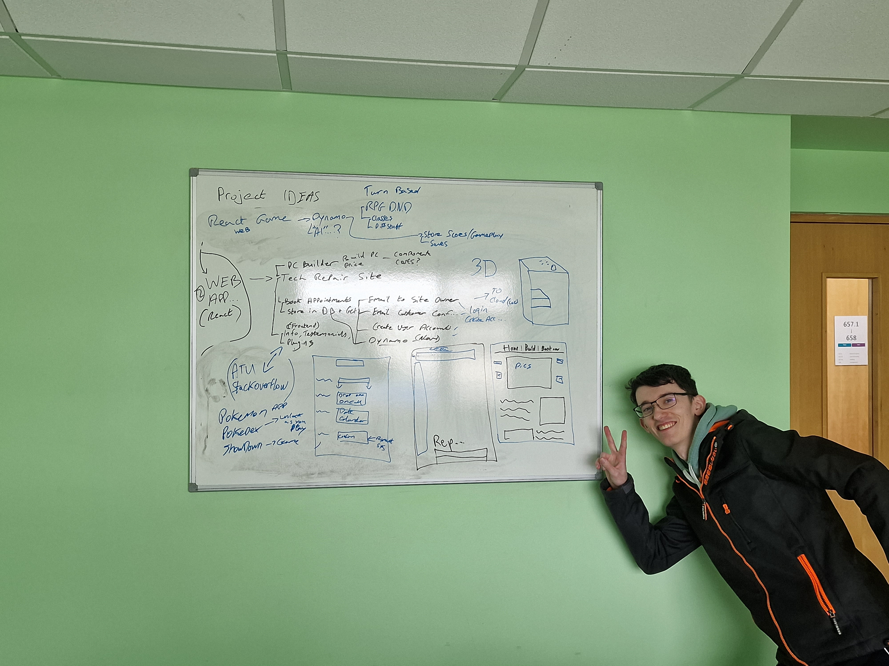
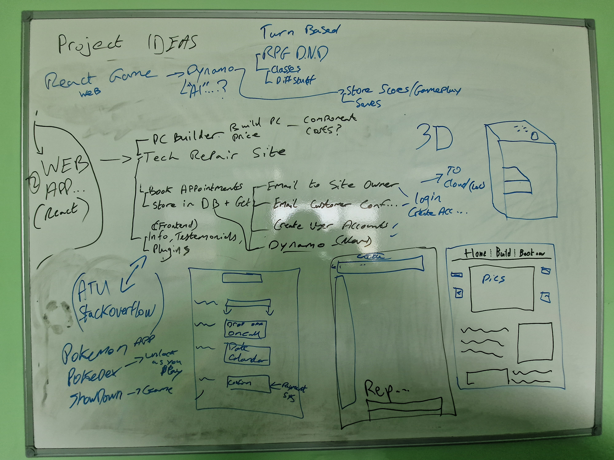

# Brainstorming Ideas

A collaborative brainstorming session was held to come up with possible
ideas for our final year project. Below you will find a list of all the
ideas we came up with followed by a detailed Enterprise Resource
Planning (ERP) report, which is broken down into three tiers, which will
walk you through the basic design and components to be used in making of
each project.

## React instant messaging inspired by Discord/WhatsApp

We discussed making a chat application based on WhatsApp and discord. It would be capable of running commands by a bot. This would give it a lot more functionality eg gif embedding, weather, news, AI, games, Pokemon Api and more.

### Tier 1 -- Presentation Layer

- **User Interface (UI):** This includes the React components responsible for rendering the messaging interface, including message bubbles, chat rooms, user profiles, and any embedded content from external APIs.
- **User Input Handling:** Implement components for typing and sending messages, as well as handling various types of content, such as text, links, images, and gifs. Provide features like message commands, autocomplete for commands, and error handling for user input.

### Tier 2 -- Model/Application Layer

- **Business Logic:** This layer handles the core functionality of the messaging application. It includes logic for sending and receiving messages, managing user sessions, storing messages when users are offline, and processing user commands. You'll need to create functions and classes for message handling, user authentication, and interaction with external APIs for additional features.
- **State Management:** Implement state management using Reacts state or state management libraries. Manage user sessions, chat history, and real-time updates to the chat interface.
- **Authentication and Security:** Implement user authentication and ensure secure communication between clients and the server. Protect user data, such as passwords and personal information, and handle authorization for various actions within the chat application.

### Tier 3 -- Data Access Layer

- Database Interaction: Golang backend server to manage user accounts, store chat history, and handle authentication.
- DynamoDB backend

### React RPG Game

We discussed making a turn-based RPG game using the React framework.

- Character Creation - examples
    - Classes such as Mage, Warrior and Thief each with different
    abilities
- Turn based game that relies on user input to guide the game to
different results and different endings. Replay ability is very
important.

Idea is new so ideas for the game are still coming. Will play like a
turn based RPG/D&D game.

### Tier 1 -- Presentation Layer

- **User Interface (UI):** This includes the React components
responsible for rendering the game\'s user interface, such as
characters inventory, and menu, etc.
- **Gameplay Components:** This includes React components for
rendering the games play area, character sprites, and other in-game
visuals (attack sprites and stuff).
- **User Input Handling:** Components for handling user inputs and user actions, such as
keyboard and mouse events. Examples -\> Character movement, menu
selection, and battle commands.

### Tier 2 -- Model/Application Logic

- **Game Logic:** This includes the core game mechanics, such as
a turn-based combat systems and character action execution, character stats (health etc), inventory management,
and quest progression. We will create JavaScript classes and functions that handle these game rules.
- **State Management:** Reacts state management, such as Redux or the
Context API, is an essential part of this tier. It helps maintain
the state of the game and user interactions.

### Tier 3 -- Data Access Layer

- **Data Storage:** If the game saves progress or data locally
(example -\> HHD or SSD). Optimally it would be stored on the cloud
(AWS or AZURE)
- **Network Communication:** For online multiplayer games or accessing the game via browser. Making
network requests and handling responses. Unsure if game will be
multiplayer.

## Pokémon Application

We discussed creating a Pokémon Application that would act similarly to
the above game but would be multiplayer. Users can pick and chose from a
small selection of Pokémon and the more they play the more Pokémon they
unlock to increase the odds of winning. It would also expand their
Pokedex giving users more information on the Pokémon they are using.

- Users signup and create an account
    - Email verification
- Pick and choose team
    - Play to win, Win = more Pokémon, lose = ???
- Data visualization for Pokémon stats in Pokedex.

More thought for this idea required!

### Tier 1 -- Presentation Layer

- **User Interface (UI):** This includes the React components
responsible for rendering the game\'s user interface, such as
Pokémon, menu, etc.
- **Gameplay Components:** Includes React components for
rendering the games play area, Pokémon sprites, and other in-game
visuals such as the Pokedex.
- **User Input Handling:** Components for handling user input, such as
keyboard and mouse events. Examples -\> Pokémon move sets, menu
selection, and battle commands.

### Tier 2 -- Model/Application Logic

- **Game Logic:** This includes the core game mechanics, such as
turn-based combat systems, Pokémon stats and progression. We will
create JavaScript classes and functions that handle these game
rules.
- **API Integration:** If the game requires interaction with a server
or external data sources such as getting the Pokémon for the
Pokedex.
- **State Management:** Reacts state management, is an essential part of this tier. It helps maintain
the state of the game and user interactions.

### Tier 3 -- Data Access Layer

- **Data Storage:** If the game saves progress or data locally
(example -\> HHD or SSD). Optimally it would be stored on the cloud
(AWS or AZURE).
- **Network Communication:** For online multiplayer games. Making
network requests and handling responses. Would work best as a
multiplayer game application.

## Tech Repair Web Application

We discussed making a Technical Repair Website for a business which
would include a homepage that would be used to navigate to the various
resources and tools of the website.

- Home Page -- Main page where navigation of the application
commences.
- Login/Signup Page
    - Security so Users and Passwords are protected.
    - Email verification to verify users.
- Bookings Page -- Used to make bookings for various services offered.
    - Bookings sent to Employer/Employees via email or text or
    other...
- PC Builder -- Build your own custom PC and see it's specifications
(PCPartPicker API and/or 3D drag and drop visuals to make a PC).
    - Possible data visualization here to see spec in relation to
    price or some other relevant data visualization implementation
    in terms of technical repairs/support.

### Tier 1 -- Presentation Layer

- **UI Components:** React components that handle the presentation of
the website, such as the homepage, service pages, booking forms, and
other visually oriented elements. So many react components to support these visuals.
- **User Input and Forms:** Components that manage user interactions,
like forms for submitting repair requests, contact information, booking requests and
user reviews.
- **Navigation:** Navigation components, including menus and links
that help users navigate the website easily and seemlessly. User friendliness is
important.

### Tier 2 -- Model/Application Layer

- **Business Logic:** *THE CODE* This encompasses the core functionality of our
website.
- **State Management:** Reacts state management tools play a crucial role in maintaining the
application\'s state and handling user interactions.
- **Data Processing:** Any data processing or transformation required
for our website\'s functionality. Making sure information
submitted/created in the Database is correct and processed
correctly. Dynamo DB was discussed as it is new to us and used in
industry by various tech companies.

### Tier 3 -- Data Access Layer

- **API Integration:** The website will need to communicate with
external services or databases for functions like accessing user
accounts, fetching the PCPartPicker API, this layer handles these
interactions. Email notifications will also be handled here for both
classes of users (employees and customers).
- **Database Interaction:** Website will rely on a database for
storing and retrieving data, the code related to database queries
and management would belong here. However, React itself doesn\'t
directly interact with databases; you\'d typically use a server or
backend technology to interact with the database. (Dynamo as
mentioned before).
- **Authentication and Security:** User authentication, authorization,
and security features, such as encryption and user access controls.

## Educational Stack Overflow -University Specific

We discussed making a Student Messaging Forum (SMF) relevant to the
University. It would ultimately be like [boards.ie](http://boards.ie/) or reddit where Users
(Students) can ask questions (either anonymously or not) about their
course of study and topics they are covering. Could also be used
potentially socially like WhatsApp where users can message each other.
Lecturers would be the ADMINS.

- Signup with college email
    - Verify if student or lecturer to get respective privileges.
    - On signing up you get directed to your course of Study and all
    the modules you have access to plus your class group
- Creating a Web Application to post and get messages from
    - Stored via DB or Cloud etc.

### Tier 1 -- Presentation Layer

- **UI Components:** React components that display the forum\'s main
pages, posts, user profiles, and any other visual elements that
users interact with.
- **User Input and Forms:** Components that handle user interactions,
such as posting questions, replying to posts, and user registration
or login forms.
- **Navigation:** Components for navigation, including menus, links,
and the user interface for moving around the forum.

### Tier 2 -- Model/Application Logic

- **Business Logic:** The heart of the forum\'s functionality, such as
posting questions, replies, editing posts, user authentication, and
authorization. It\'s where you manage and control what actions are
allowed and how data is processed.
- **State Management:** Keeping track of user sessions, posts, and
interactions. Moderation.
- **Data Processing:** Processing and transforming data, like
validating user inputs, formatting post content, and applying any
business rules specific to your forum. No NSFW posts.

### Tier 3 -- Data Access Layer

- **API Integration:** If we want to integrate our forum with external
services, like sending email notifications or fetching additional
information about courses or students, the logic for these
integrations goes here.
- **Database Interaction:** Managing interactions with a database is
crucial for storing and retrieving posts, user accounts, and other
data related to our forum. Typically, this involves a backend server
interacting with the database, but it\'s a crucial part of the
application.
- **Authentication and Security:** Handling user authentication,
ensuring secure communication, and managing user data securely, such
as passwords and personal information.
