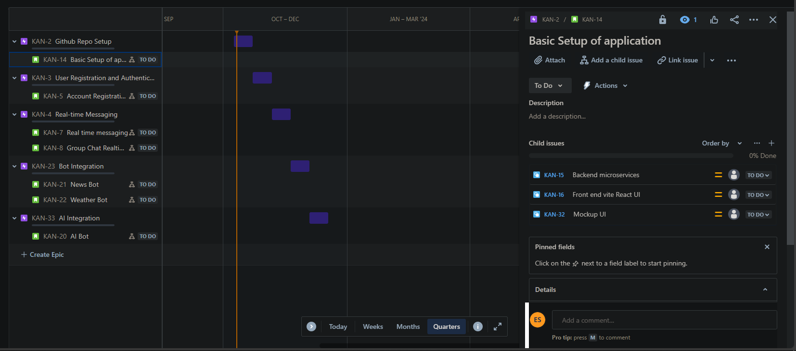
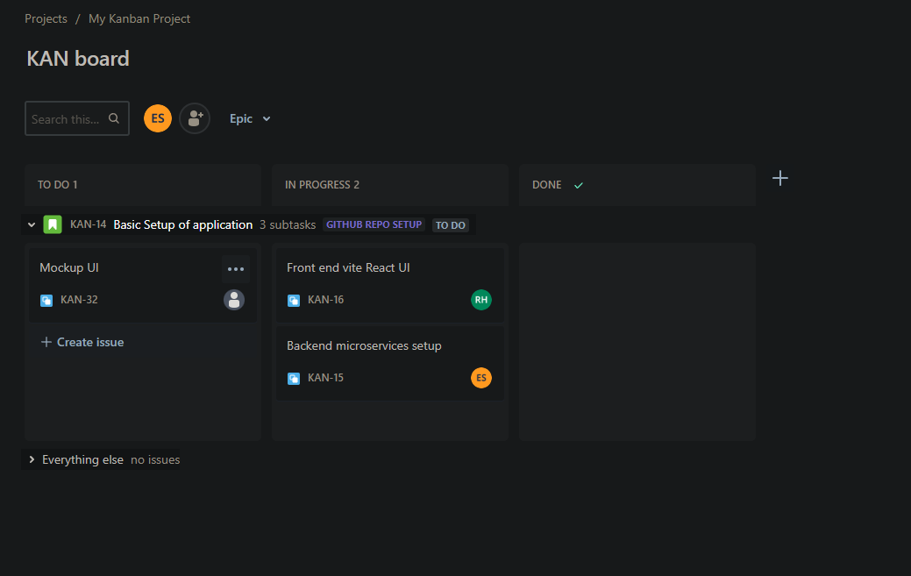

# B.Sc. (Honours) in Software Development Applied Project & Minor Dissertation

<h1 style="color: red;">Project Proposal</h1>

 <strong style="color: red;">1. Student Name:</strong>Ethan Conneely (G00393941)

 <strong style="color: red;">2. Supervisor Name:</strong>Gemma O'Callaghan

 <strong style="color: red;">3. Project Name:</strong>AI-Integrated Messenger Application - Chatalyst

<h1 style="color: red;">4. Project Context:</h1>

In today's digital world, instant communication is a fundamental part of our lives. With the continuous advancement of technology, users are always seeking better ways to connect with friends and family. Artificial Intelligence (AI) is becoming increasingly prevalent, and users are now looking for communication platforms that are smarter, more intuitive, and user-friendly. This project aims to develop an instant messaging application, named Chatalyst, with a strong focus on AI and bot integration. Chatalyst will allow users to create accounts, engage in instant messaging, share multimedia files, and interact with AI-powered bots to enhance their communication experience.

<h2 style="color: red;">4.1 Project Interests:</h2>

This project is of great interest as it integrates various cutting-edge technologies and frameworks. Developing an application that users will appreciate and using industry-recognized technologies is a valuable experience as final-year students.

<h2 style="color: red;">4.2 Project Description:</h2>

We aim to develop an AI-Integrated messaging application with the following key features:

- **Intuitive User Interface:** The project prioritizes an aesthetically pleasing and functional user interface. It includes theme customization, user profile customization, and other features to give users control over the app's appearance.

- **Personalized User Profiles:** Users can create and customize their profiles, including profile pictures and friend interactions.

- **Instant Communication:** In addition to basic messaging, Chatalyst will support multimedia sharing, enhancing communication capabilities.

- **AI-Powered Interactions:** AI-driven bots will be integrated to provide various services to users, such as smart replies, news updates, weather information, and a Pokémon bot.

- **Robust Backend Framework:** The project focuses on optimizing database operations and ensuring scalability for a smooth user experience.

- **Responsive Feedback Mechanism:** A system for users to report bugs and provide feedback on the application will be implemented to continuously improve the user experience.

- **Data Security:** The project will prioritise data privacy through end-to-end encryption and oauth signin/signup.

<h1 style="color: red;">5. Project Objectives:</h1>

- **Development of a User-Friendly Interface (UI)**

  - **Overview:** Create a UI that is user friendly and aesthetically pleasing.
  - **Components:**
    - UI/UX to design the interface before implementation.
    - Responsiveness so the application responds in real time.
    - Theme customization. Light and Dark mode.

- **User customization capabilities**

  - **Overview:** Users can create, customise their profiles.
  - **Components:**
    - Register an account.
    - Login/Logout.
    - Two Factor Authentication.
    - Profile customization, profile pictures etc...
    - Add/Remove Friends

- **Instant Messaging communication**

  - **Overview:** Users can create and send messages to people they are friends with.
  - **Components:**
    - Send and receive messages.
    - Send and receive multimedia in all forms.

- **Implement AI/Bots**

  - **Overview:** Implementation of AI/Bots to provide various services to users based on their capabilities.
  - **Components:**
    - Smart Reply Bot: Allows users to reply to messages through to use of a bots auto generated selection for quick and seamless replies.
    - News Bot: A bot that will give news to the user relevant to their location and interests.
    - Weather Bot: A bot that will tell users the weather at their location or a location of their choosing along with other relevant details.
    - Pokémon Bot: A funny Pokémon bot that will give a user relevant information on a Pokémon of their choosing. Will be a Pokédex bot essentially.

- **Scalable Backend Infrastructure**

  - **Overview:** To build a robust backend using (enter DB here) that can handle the initial users of the application and those that could join in the future.
  - **Components:**
    - Optimised Database Queries: Essential to have the DB queries correctly implemented to avoid timeouts or deadlock states.
    - Database Selection: Making sure we are using the correct Database for scalability and that suits our applications purpose.

- **Issue/Bug Reports**

  - **Overview:** Build a system that users can use to report issues/bugs in the application via a UI.
  - **Components:**
    - Ticketing System: An efficient system that tracks and prioritizes issues/bugs based on severity.
    - Feedback Interface: A UI interface for reporting issues/bugs.

- **Data Privacy/Security**
  - **Overview:** User details remain private through encryption.
  - **Components:**
    - End to End Encryption: Ensure user conversations and private details remain encrypted.
    - Implement 2 factor authentication to keep users' data secure.
    - Email verification on all account setups.
    

<h1 style="color: red;">6. Technologies/System Architecture</h1>

Chatalyst will be developed using the following technologies and system architecture:

**Frontend:**

- **React:** Chosen for its flexibility, component-based architecture, and industry recognition. Material-UI will be used for a consistent and interactive user interface.

**Back-End:**

- **GoLang:** Selected for its concurrency support, which is essential for handling a large number of concurrent user requests. It also allows for shared types between the frontend and backend.

- **MongoDB:** Chosen for its ability to store JSON-formatted data, suitable for complex data structures.

**AI – Integration:**

AI capabilities powered by leading-edge machine learning algorithms for smart replies, news updates, weather information, and more.
Schedule of Work
The project will follow the Agile methodology, specifically the Scrum framework, working in 2-week sprints. A JIRA project has been set up to manage the project's tasks.

<h1 style="color: red;">7. Schedule of Work</h1>

Our project employs the Agile Methodology 'Scrum'.

We have planned out the work for each sprint we will be undertaking during the project it will be expanded as we work on it and encounter bugs in the application. We will be working in 2 week sprints.
At the end of each sprint we will do a sprint retrospective going over what we felt went well and what issues we encountered.

**JIRA**

- We have created a JIRA to organise our workload into 'sprints' and have created a Gantt Chart and Kanban board to keep our work organised and we can clearly see when project deadlines and goals are to be met this is just the initial layout of work as the requirements become more clear we will add more tasks to it.

'_Jira -_ [https://ethanryanfinalyearproject.atlassian.net/jira/software/projects/KAN/boards/1/timeline?timeline=MONTHS](https://ethanryanfinalyearproject.atlassian.net/jira/software/projects/KAN/boards/1/timeline?timeline=MONTHS)
_Our work load Gantt Chart from now to December 2023'_

- **Sprint 1:** Project setup for both backend and frontend, and initial project and feature documentation.

- **Sprint 2:** UI mock-up and basic user authentication.

- **Sprint 3:** Finalizing user signup/signin UI and starting work on the messaging user interface and backend.

- **Sprint 4:** Integrating with bots and external APIs to enhance the messaging application's capabilities.

- **Sprint 5:** Implementing a Large Language Model (LLM) AI for intelligent message responses.

- **Sprint 6:** Bug fixing, polishing application functionality, and ensuring consistent UI styling.

